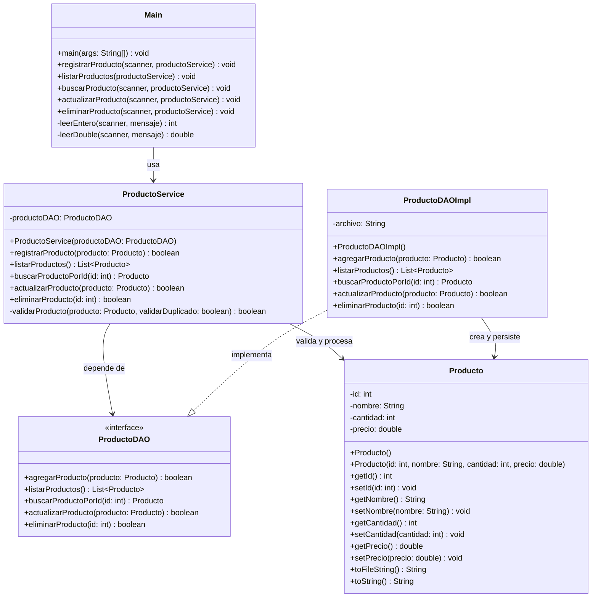

# Diagrama de Clases UML

## 1. Descripcion general

El siguiente diagrama representa la estructura del sistema por capas:

- Capa de presentacion.
- Capa de logica de negocio.
- Capa de acceso a datos.
- Capa de entidades.

Tambien se muestran:

- Las relaciones de dependencia.
- La interfaz utilizada por la capa DAO.
- La implementacion concreta de la persistencia.

## 2. Diagrama UML

## 3. Interpretacion del diagrama

### Capa de Presentacion

- `Main` interactua directamente con el usuario.
- No accede al archivo de datos de forma directa.

### Capa de Logica de Negocio

- `ProductoService` recibe solicitudes desde `Main`.
- Valida datos antes de delegar las operaciones.

### Capa DAO

- `ProductoDAO` define las operaciones necesarias.
- `ProductoDAOImpl` implementa el acceso real a `productos.txt`.

### Capa de Entidades

- `Producto` representa el objeto central del sistema.

## 4. Relaciones principales

- `Main` depende de `ProductoService`.
- `ProductoService` depende de la abstraccion `ProductoDAO`.
- `ProductoDAOImpl` implementa la interfaz `ProductoDAO`.
- `ProductoService` y `ProductoDAOImpl` trabajan con objetos `Producto`.
